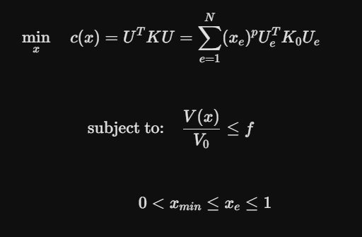
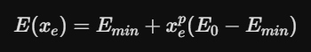
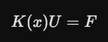
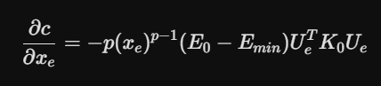
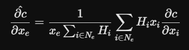

# FEA Generative CTO Engine

Built a 2D generative design engine from scratch to figure out how the math behind aerospace lightweighting actually works. Instead of relying on commercial black-box CAD software, this repository contains a modular, from-scratch Python engine implementing the **Solid Isotropic Material with Penalization (SIMP)** method combined with a custom Finite Element Method (FEM) solver.

Engineered & Developed by Nabil Khondaker.
---

## 🛠 Directory Architecture

This engine is architected using enterprise-grade modular principles to decouple global configurations, mesh generation, finite element solvers, and mathematical optimization filters.

```text
TopologyOptimizationEngine/
│
├── run_optimization.py             # Master execution script tying the engine together
│
├── config/                         # Configuration layer
│   ├── __init__.py                 # Exposes the parameter API
│   └── parameters.py               # Global physical constants & material properties
│
├── engine/                         # Core Physics Engine
│   ├── __init__.py                 # Package metadata
│   │
│   ├── mesh/                       # Discretization layer
│   │   ├── __init__.py             # Exposes QuadElement
│   │   └── elements.py             # Formulates 2D 4-node quad stiffness matrix (KE)
│   │
│   ├── fem/                        # Structural Analysis layer
│   │   ├── __init__.py             # Exposes solver & boundary conditions
│   │   ├── boundary_conditions.py  # Fixes DOFs and applies point loads (Cantilever beam)
│   │   └── solver.py               # Handles vectorized global sparse matrix assembly & solver
│   │
│   └── optimization/               # Convergence & Math optimization layer
│       ├── __init__.py             # Exposes filters & OC updater
│       ├── filters.py              # Mesh-dependency sensitivity filter (kills checkerboarding)
│       └── simp_oc.py              # Optimality Criteria (Lagrange bisection algorithm)
```

## 🧠 The Engineering Core (How It Works)

Most designers just click "Optimize" in Fusion 360 or ANSYS. This project pulls back the curtain on the actual solid mechanics:

1. Objective Function (Compliance Minimization)
   - The core goal is to find the optimal material density distribution $x$ that minimizes the global structural compliance $c$ (which maximizes stiffness), subject to a volume constraint:

Where:
- U is the global displacement vector.
- K is the global stiffness matrix.
- xₑ is the pesudo-density of element e.
- p is the SIMP penalization power (usually set to 3.0).
- f is the targeted volume fraction constraint.
2. SIMP Material Interpolation (The Power Law)
  - To force a binary "solid or void" structure, the Young's Modulus E of each element is penalized based on its density variable xₑ:

By raising xₑ to the power of p, intermediate densities (like xₑ = 0.5) provide very little stiffness relative to their weight. This forces the optimization loop to push elements toward either absolute solid (1) or empty space (0).
3. Finite Element System Linear Equation
  - At each optimization iteration, the global static equilibrium equation is solved using high-performance sparse matrix manipulation:

4. Sensitivity Analysis & Filtering
  - The gradient of compliance with respect to element densities is calculated to guide the optimizer on where to add or remove material:

  - To eliminate the physical artifact of "checkerboarding" (where the mesh creates alternating solid and empty squares), a mesh-independency spatial filter is applied to the raw sensitivities across a localized radius rₘᵢₙ:


---

## 🚀 Getting Started

### 📋 Prerequisites
Ensure you have Python 3.8+ installed on your system. This engine relies on high-performance numerical and visualization libraries.

### 📥 Installation

1. **Clone the repository:**
   ```bash
   git clone [https://github.com/yourusername/OpenSIMP-Engine.git](https://github.com/yourusername/OpenSIMP-Engine.git)
   cd OpenSIMP-Engine
   ```
2. **Set up a virtual environment (Highly recommended):**
   ```bash
   # On macOS/Linux
   python3 -m venv venv
   source venv/bin/activate
   # On Windows
   python -m venv venv
   .\venv\Scripts\activate
   ```

3. **Install dependencies:**
```bash
pip install numpy scipy matplotlib
```
---

## 📊 Expected Output

When you run the engine, it will print structural metrics directly to your terminal at every mathematical iteration:
```text
INITIALIZING TOPOLOGY OPTIMIZATION ENGINE...
BEGINNING ITERATIVE SOLVER...
  Iteration: 001 | Compliance: 243.5120 | Volume: 0.400 | Change: 0.2000
  Iteration: 002 | Compliance: 189.2311 | Volume: 0.400 | Change: 0.1843
  ...
  Iteration: 045 | Compliance: 82.1042  | Volume: 0.400 | Change: 0.0092

OPTIMIZATION CONVERGED SUCCESSFULLY.
```
Simultaneously, a live graphic window will pop up showing an initial uniform grey block morphing organically into an idealized, lightweight, high-stiffness cantilever truss.
---

## 📄 License
Distributed under the MIT License. See `LICENSE` for more details.


